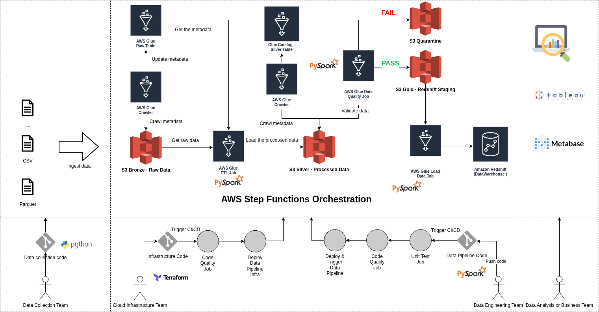

# Nash DataOps Terraform Infrastructure

This repository provisions the dev AWS infrastructure for a Bronze/Silver/Gold data pipeline using S3, Glue, Glue Data Quality, Step Functions, Redshift, and local Metabase.

## Architecture



## Presentation Docs

- `docs/dataops-presentation-guide.md`: speaker-ready guide matching the
  presentation table of contents.
- `metabase/docs/dashboard-metric-guide.md`: guide for reading each Metabase
  dashboard metric.

## Project Structure

- `terraform/main.tf`: provider, S3 backend, S3 data bucket, IAM, VPC lookup, Glue script upload, and Redshift cluster resources.
- `terraform/bootstrap_remote_state.sh`: one-time bootstrap for the S3 state bucket and DynamoDB lock table.
- `terraform/glue_catalog.tf`: Glue database and Bronze/Silver crawlers.
- `terraform/glue_process_raw_data_job.tf`: Bronze-to-Silver Spark job.
- `terraform/glue_data_quality.tf`: Glue Data Quality rulesets for the Bronze input gate and Silver output gate.
- `terraform/glue_quarantine_failed_data_job.tf`: quarantine job used by the failure branch.
- `terraform/glue_load_data_to_redshift_job.tf`: Redshift connection, schema job, and COPY load job.
- `terraform/glue_workflow.tf`: Step Functions state machine plus EventBridge schedule.
- `terraform/observability.tf`: metric-only CloudWatch observability dashboard.
- `terraform/outputs.tf`: useful deployment outputs.
- `metabase/`: local Metabase and Postgres setup.
- `data/`: sample trip Parquet files and taxi zone lookup data.

## Pipeline Flow

1. Raw trip files and reference data are manually uploaded to `bronze/`.
2. The Bronze Glue crawler creates `bronze_fhvhv_trips`.
3. Glue Data Quality evaluates Bronze input rules before transformation.
4. Glue transforms Bronze to Silver Parquet at `silver/fhvhv_trips/`, partitioned by `pickup_year`, `pickup_month`, and `run_id`.
5. The Silver crawler creates `silver_fhvhv_trips`.
6. Glue Data Quality evaluates Silver rules: required identifiers, timestamps, zones, row count, month bounds, and trip duration bounds.
7. Failed Silver quality runs are written to `quarantine/fhvhv_trips/run_id=<run_id>/` and the state machine fails intentionally.
8. Passing runs create or verify the Redshift star schema.
9. The load job writes Gold Parquet staging files and uses Redshift `COPY` into staging tables before upserting dimensions and facts.

## Deployment

Prerequisites:

- AWS CLI configured with profile `cloud-user`
- Terraform v1.0+
- S3 bucket for Terraform state and DynamoDB table for state locking
- `terraform.tfvars` in `terraform/`

Example `terraform.tfvars`:

```hcl
region           = "us-west-1"
data_bucket_name = "nash-dataops-data-630952739663-us-west-1-dev"
environment      = "dev"
upload_sample_data = false

redshift_username = "admin"
redshift_password = "ReplaceWithYourOwnPassword123!"
redshift_node_type = "ra3.large"

tags = {
  Owner      = "DataOps-Team"
  Project    = "ETL-Demo"
  CostCenter = "DataEngineering"
}
```

Deploy:

```bash
export AWS_PROFILE=cloud-user

cd terraform
./bootstrap_remote_state.sh
cp terraform.tfvars.example terraform.tfvars
# Edit terraform.tfvars and replace redshift_password.
terraform init
terraform apply
```

Upload input data manually before running the pipeline:

```bash
aws s3 cp ../data/fhvhv_trips/2024/01/fhvhv_tripdata.parquet \
  s3://$(terraform output -raw data_bucket_name)/bronze/fhvhv_trips/2024/01/fhvhv_tripdata.parquet

aws s3 cp ../data/fhvhv_trips/2024/02/fhvhv_tripdata.parquet \
  s3://$(terraform output -raw data_bucket_name)/bronze/fhvhv_trips/2024/02/fhvhv_tripdata.parquet

aws s3 cp ../data/taxi_zone_lookup.csv \
  s3://$(terraform output -raw data_bucket_name)/bronze/reference/taxi_zone_lookup.csv
```

Start a manual pipeline run:

```bash
aws stepfunctions start-execution \
  --state-machine-arn "$(terraform output -raw step_functions_state_machine_arn)" \
  --name "manual-$(date +%Y%m%d%H%M%S)" \
  --input '{}'
```

## Observability

Terraform provisions a CloudWatch observability dashboard for operational
pipeline metrics only. It does not create alarms, tracing resources, or
log-derived metric filters.

The dashboard includes:

- Step Functions execution starts, successes, failures, timeouts, and duration.
- Glue ETL elapsed time, completed tasks, and bytes read for each pipeline job.
- Glue Data Quality passed and failed rule metrics for the Bronze and Silver rulesets.

Open the dashboard after `terraform apply`:

```bash
terraform output -raw cloudwatch_observability_dashboard_url
```

## Redshift Model

The warehouse model is intentionally small but presentation-friendly:

- `nyc_taxi.dim_zone`
- `nyc_taxi.dim_date`
- `nyc_taxi.fact_fhvhv_trips`

This supports dashboard questions such as busiest pickup zones, trip volume by date, and trip duration by route.

## Metabase

```bash
cd metabase
cp .env.example .env
# Edit .env and set REDSHIFT_PASSWORD to the Terraform Redshift password.
docker compose up -d
./setup-redshift-database.sh
./import-demo-dashboards.py
```

Open `http://localhost:3001`. The helper script creates or updates the local
Metabase Redshift connection for the `nyc_taxi` schema, then imports the demo
dashboards. See `metabase/README.md` for manual connection details and sample
dashboard SQL.

The dashboard reading guide is in
`metabase/docs/dashboard-metric-guide.md`.

## Cleanup

```bash
cd terraform
terraform destroy
```
